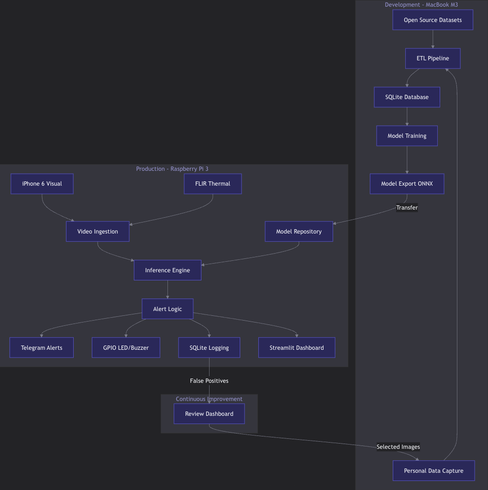
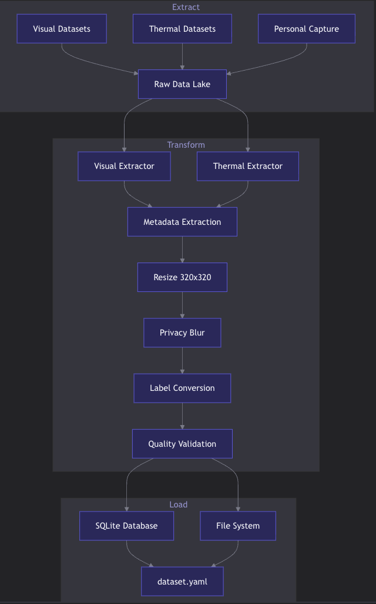
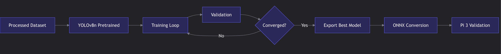
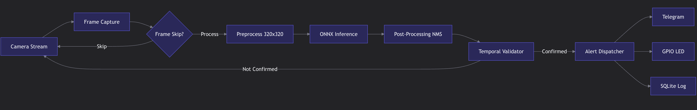

# EFDS-Lite — Early Fire Detection System

[](https://www.python.org/)
[](https://github.com/ultralytics/ultralytics)
[](https://onnxruntime.ai/)
[](https://opencv.org/)
[](LICENSE)
[](LICENSE-MODEL)

A **zero-cost, privacy-first fire detection system** built for personal data centres and home labs. DC-EFDS-Lite combines computer vision (smoke and flame detection) with optional thermal imaging to provide early warning well before a traditional smoke detector would activate — using hardware you likely already own.

---

## What this project does

Traditional smoke detectors wait for airborne particles to reach a sensor. In a server room with active cooling or high ceilings, that reaction time can be dangerously slow. EFDS-Lite watches your cameras continuously and alerts you the moment it visually identifies smoke or flame — often minutes earlier.

The system runs entirely on a **Raspberry Pi 3** using a repurposed **iPhone 6 as the camera**. No cloud subscription, no monthly fees, no video leaving your premises.

```
Your Phone  ──►  Raspberry Pi 3  ──►  YOLOv8 model  ──►  Telegram alert
(IP stream)       (inference)          (smoke/flame)        (within 2s)
```

---

## Key features

- **Visual detection** — identifies smoke and flame patterns in real-time video
- **Thermal detection** — optionally connects a FLIR One camera for temperature-based pre-fire alerts (60°C+ warning, 80°C+ critical)
- **Multi-modal fusion** — combines visual confidence with thermal data to reduce false positives
- **Telegram alerts** — push notifications with a snapshot photo within 2 seconds of confirmation
- **100% local processing** — no internet required for inference, video never leaves the device
- **Active learning loop** — false positives can be tagged and fed back into retraining
- **Streamlit dashboard** — local web UI showing live alerts, system health, and detection history
- **Auto-restart** — systemd service keeps the pipeline running 24/7

---

## Hardware you need

| Component | Purpose | Cost |
|-----------|---------|------|
| Raspberry Pi 3 Model B+ | Runs inference 24/7 | ~$35 (or repurposed) |
| iPhone 6 (or any IP camera) | Video source via IP Webcam app | $0 repurposed |
| MicroSD card 16GB+ | OS and storage | ~$8 |
| MacBook / laptop | Model training (one-time) | Already owned |
| FLIR One Gen 3 *(optional)* | Thermal pre-fire detection | ~$150–200 |
| Red LED + buzzer *(optional)* | Local hardware alerts | <$5 |

**Total cost: $0–$250** depending on what you already own. The Basic tier (Pi 3 + iPhone) costs nothing if you have the hardware.
**Notes: 
---

## How it works 

1. Your iPhone streams live video over your local Wi-Fi
2. The Raspberry Pi captures frames and runs them through a YOLOv8 model — a type of AI trained specifically to recognise smoke and flame patterns
3. The model needs to see a detection in 5 consecutive frames (not just one) before triggering an alert — this prevents false alarms from steam or reflections
4. When confirmed, the Pi sends a Telegram message with a photo to your phone, logs the event, and can trigger a physical LED/buzzer
5. The model was trained on 40,000+ labelled images including photos of your specific server room in normal conditions — so it knows the difference between a server rack LED and a fire

---

## Detection performance targets

| Metric | Target | What it means |
|--------|--------|---------------|
| mAP@50 | > 0.85 | Model correctly locates detections 85% of the time |
| False positive rate | < 1% per day | Less than one wrong alert per day |
| Alert delivery | < 2 seconds | From confirmed detection to Telegram message |
| Inference on Pi 3 | < 500ms per frame | Fast enough for real-time monitoring |
| RAM usage | < 400MB | Fits within Pi 3's 1GB limit |
| System uptime | 99%+ | Survives reboots and network drops via systemd |

---

## Quick start

### Prerequisites

- Python 3.9+
- A Raspberry Pi 3 with Raspberry Pi OS Lite (64-bit)
- An iPhone with the [IP Webcam app](https://apps.apple.com/app/ip-webcam/id990605862) (or any RTSP camera)
- A Mac or Linux machine for training (one-time)

### 1. Set up the development environment (Mac)

```bash
git clone https://github.com/yourname/dc-efds-lite.git
cd dc-efds-lite
python3 scripts/setup_mac.py
source venv/bin/activate
```

### 2. Download training data

```bash
python scripts/download_datasets.py --datasets dfire personal
```

The `personal` option creates a capture script — run it pointed at your server room to collect negative samples. This is the most important step for reducing false alarms in your specific environment.

### 3. Train the model

```bash
python scripts/train.py --epochs 50 --device mps
```

Takes about 45–60 minutes on a MacBook M3. The trained model is automatically exported to `models/best.onnx`.

### 4. Deploy to Raspberry Pi

```bash
# On your Mac — copy the model
scp models/best.onnx pi@<raspberry-pi-ip>:~/dc-efds-lite/models/

# SSH into Pi and run setup
ssh pi@<raspberry-pi-ip>
git clone https://github.com/yourname/dc-efds-lite.git
cd dc-efds-lite
bash scripts/setup_pi3.sh
```

### 5. Configure and validate

```bash
# Edit your camera URL and Telegram credentials
nano .env
nano config/pipeline.yaml

# Run the validation checker
python scripts/validate_install.py --source "http://<iphone-ip>:8080/video"
```

### 6. Start the system

```bash
# Manual test first
python src/inference/pipeline.py --source "http://<iphone-ip>:8080/video" --headless

# Enable auto-start
sudo systemctl enable dc-efds.service
sudo systemctl start dc-efds.service
```

---
## High-Level System Architecture


## ETL Pipeline


## Training Architecture


## Inference Architecture


## Project structure

```
dc-efds-lite/
├── src/
│   ├── inference/
│   │   └── pipeline.py          # Main detection engine
│   ├── alerts/                  # Telegram + GPIO dispatchers
│   └── dashboard/               # Streamlit monitoring UI
├── scripts/
│   ├── setup_mac.py             # One-click Mac dev setup
│   ├── setup_pi3.sh             # Raspberry Pi 3 setup
│   ├── download_datasets.py     # Dataset acquisition
│   ├── train.py                 # Model training (Mac M3/MPS)
│   ├── capture_negatives.py     # Personal negative sample capture
│   └── validate_install.py      # Pre-demo validation checker
├── config/
│   ├── pipeline.yaml            # Inference settings
│   └── training.yaml            # Training hyperparameters
├── models/
│   ├── weights/                 # PyTorch .pt checkpoints
│   └── best.onnx                # Deployed ONNX model (~6MB)
├── data/
│   ├── raw/                     # Downloaded datasets
│   ├── processed/               # ETL output (train/val/test split)
│   └── alerts/                  # Saved alert snapshots
├── database/
│   ├── schema.sql               # SQLite schema
│   └── alerts.db                # Runtime event log
└── logs/
    └── pipeline.log             # System logs
```

---

## Training datasets used

| Dataset | Images | What it adds |
|---------|--------|--------------|
| [D-Fire](https://github.com/gaiasd/DFireDataset) | 21,000 | Core fire and smoke detection |
| [Roboflow Fire & Smoke](https://universe.roboflow.com/middle-east-tech-university/fire-and-smoke-detection-hiwia) | 6,400 | Diverse environments, MIT licensed |
| [Kaggle Fire Detection](https://www.kaggle.com/datasets/phasukkk/firedetection) | 17,000 | Negative samples and augmentation |
| Personal captures | 500+ | Your specific server room — reduces false alarms |

---

## Configuration

Edit `config/pipeline.yaml` to tune the system for your environment:

```yaml
camera:
  source: "http://192.168.1.XX:8080/video"   # Your iPhone IP

model:
  confidence_threshold: 0.50    # Lower = more sensitive, more false positives
  
inference:
  frame_skip: 3                 # Process 1 in 3 frames (Pi 3 performance)
  persistence_frames: 5         # Consecutive detections needed before alert
  cooldown_seconds: 30          # Minimum gap between alerts
```

---

## Safety disclaimer

> **DC-EFDS-Lite is a supplementary early-warning tool, not a certified fire safety system.**
>
> This project is not UL or CE certified. It should never replace professional smoke detectors, fire suppression systems, or legally required safety equipment. Always maintain standard fire safety infrastructure alongside this system.

---

## Deployment tiers

| Tier | Hardware | Capability |
|------|----------|------------|
| Basic | Pi 3 + iPhone 6 | Visual smoke and flame detection |
| Pro | Pi 3 + iPhone 6 + FLIR One | Visual + thermal pre-fire detection |
| Enhanced | Pi 4 + iPhone 6 + FLIR One | Better performance, lower latency |

---

## Monitoring

Once running, check system health via:

```bash
# Service status
sudo systemctl status dc-efds.service

# Live logs
tail -f logs/pipeline.log

# Local dashboard
streamlit run src/dashboard/app.py
# Open: http://<raspberry-pi-ip>:8501

# Recent alerts in database
sqlite3 database/alerts.db "SELECT * FROM alerts ORDER BY timestamp DESC LIMIT 10;"
```

---

## Common issues

| Problem | Solution |
|---------|----------|
| Camera stream won't connect | Verify iPhone IP; ensure IP Webcam app is running; check same Wi-Fi network |
| Too many false positives | Add more server room negatives; increase `confidence_threshold` to 0.60; increase `persistence_frames` to 7 |
| Slow inference on Pi 3 | Ensure `frame_skip: 3` in config; check Pi is not overheating (`vcgencmd measure_temp`) |
| Telegram alerts not sending | Test bot token with curl; ensure you sent `/start` to the bot first |
| Out of memory crashes | Add 1GB swap: `sudo dphys-swapfile` config; disable dashboard if not needed |

---

## License

| Component | License |
|-----------|---------|
| Project code | MIT — free for any use |
| YOLOv8 model weights | AGPL-3.0 — review before commercial use |
| D-Fire dataset | Research use only |
| Roboflow dataset | MIT |
| FLIR Thermal dataset | Free for research and commercial use |

---

## Acknowledgements

- [Ultralytics YOLOv8](https://github.com/ultralytics/ultralytics) — object detection backbone
- [D-Fire Dataset](https://github.com/gaiasd/DFireDataset) — primary training data
- [Roboflow Universe](https://universe.roboflow.com/) — annotated fire and smoke images
- [ONNX Runtime](https://onnxruntime.ai/) — optimised CPU inference on ARM

---

*Built as a personal lab safety project. Contributions and issues welcome.*
